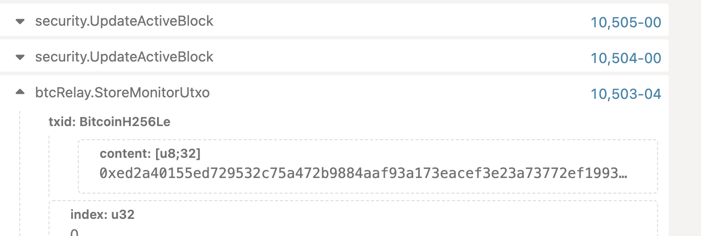

# boomerang-cli

## 1 install bitcoin UI and run wallet rpc serve

download from https://bitcoincore.org/bin/bitcoin-core-22.0/

macos run

```
/Applications/Bitcoin-Qt.app/Contents/MacOS/Bitcoin-Qt -regtest -server -rpcuser=rpcuser -rpcpassword=rpcpassword -rpcport=18332
```

linux run

```
bitcoin-qt  -regtest -server -rpcuser=rpcuser -rpcpassword=rpcpassword -rpcport=18332
```

tip: Macos need install bitcoin-cli from code

```
//install bitcoin v22.0 bitcoin-cli

git clone https://github.com/bitcoin/bitcoin.git
cd bitcoin
git checkout a0988140b7
./autogen.sh
./configure
make
sudo make install
```

tip: may need install autoconf automake

## 2 run ggx node

```
git clone https://github.com/ggxchain/ggxnode.git
git checkout boomerang-utxo
cargo run --features brooklyn -- --dev --rpc-external --unsafe-rpc-external --rpc-methods=unsafe -d ../data
```

## 3 run test

yarn install
yarn test

## 4 CreateBoomerang

### 4.1 build code

yarn install
yarn build

### 4.2 set bcli alias

alias bcli='bitcoin-cli -regtest -rpcuser=rpcuser -rpcpassword=rpcpassword -rpcport=18332'

tip: test key

```
Owner:      Key:                                                                Pubkey:
alice       2bd806c97f0e00af1a1fc3328fa763a9269723c8db8fac4f93af71db186d6e90    9997a497d964fc1a62885b05a51166a65a90df00492c8d7cf61d6accf54803be
ggx         81b637d8fcd2c6da6359e6963113a1170de795e4b725b84d1e0b4cfd9ec58ce9    4edfcf9dfe6c0b5c83d1ab3f78d1b39a46ebac6798e08e19761f5ed89ec83c10
intrnl      1229101a0fcf2104e8808dab35661134aa5903867d44deb73ce1c7e4eb925be8    f30544d6009c8d8d94f5d030b2e844b1a3ca036255161c479db1cca5b374dd1c
```

### 4.2 send btc to alice address mkESjLZW66TmHhiFX8MCaBjrhZ543PPh9a

```
bcli sendtoaddress mkESjLZW66TmHhiFX8MCaBjrhZ543PPh9a  1
```

output

```
b049b16c0e0c58d574073db64cf5324a78f6703b96e6dadc6dde629529f8bf9c
```

### 4.4 get unspend utxo

```
bcli getrawtransaction  b049b16c0e0c58d574073db64cf5324a78f6703b96e6dadc6dde629529f8bf9c 1
```

output

```
{
  "txid": "b049b16c0e0c58d574073db64cf5324a78f6703b96e6dadc6dde629529f8bf9c",
  "hash": "b049b16c0e0c58d574073db64cf5324a78f6703b96e6dadc6dde629529f8bf9c",
  "version": 2,
  "size": 225,
  "vsize": 225,
  "weight": 900,
  "locktime": 549,
  "vin": [
    {
      "txid": "6f97a5165101d59c6851c919732bdc0b89c6743638a388c5e4fc404ea59ccaaa",
      "vout": 0,
      "scriptSig": {
        "asm": "304402205230fda2728cd42c8c69d0a89d6d683ee480b09e2f3abbd9b85d5222ea6a9fc90220049d4365e426656b0131136ad5b512816472e280d878f4cbecb261edf82fa4db[ALL] 0229729d6f80ca7f657549f27cb374d57b9761828799995e51b06eae6850f1479d",
        "hex": "47304402205230fda2728cd42c8c69d0a89d6d683ee480b09e2f3abbd9b85d5222ea6a9fc90220049d4365e426656b0131136ad5b512816472e280d878f4cbecb261edf82fa4db01210229729d6f80ca7f657549f27cb374d57b9761828799995e51b06eae6850f1479d"
      },
      "sequence": 4294967293
    }
  ],
  "vout": [
    {
      "value": 1.00000000,
      "n": 0,
      "scriptPubKey": {
        "asm": "OP_DUP OP_HASH160 33b94b70bbd434f0ad01925669bedf3469832b58 OP_EQUALVERIFY OP_CHECKSIG",
        "desc": "addr(mkESjLZW66TmHhiFX8MCaBjrhZ543PPh9a)#sf4zxhpd",
        "hex": "76a91433b94b70bbd434f0ad01925669bedf3469832b5888ac",
        "address": "mkESjLZW66TmHhiFX8MCaBjrhZ543PPh9a",
        "type": "pubkeyhash"
      }
    },
    {
      "value": 5.24198053,
      "n": 1,
      "scriptPubKey": {
        "asm": "OP_DUP OP_HASH160 bb4067f03f7c340d3e931f3f4b27d4c28ad460fd OP_EQUALVERIFY OP_CHECKSIG",
        "desc": "addr(mxb3ow9H5hMbR7QgBoc4cPef3cWgi4UZy8)#kqcp8chl",
        "hex": "76a914bb4067f03f7c340d3e931f3f4b27d4c28ad460fd88ac",
        "address": "mxb3ow9H5hMbR7QgBoc4cPef3cWgi4UZy8",
        "type": "pubkeyhash"
      }
    }
  ],
  "hex": "0200000001aaca9ca54e40fce4c588a3383674c6890bdc2b7319c951689cd5015116a5976f000000006a47304402205230fda2728cd42c8c69d0a89d6d683ee480b09e2f3abbd9b85d5222ea6a9fc90220049d4365e426656b0131136ad5b512816472e280d878f4cbecb261edf82fa4db01210229729d6f80ca7f657549f27cb374d57b9761828799995e51b06eae6850f1479dfdffffff0200e1f505000000001976a91433b94b70bbd434f0ad01925669bedf3469832b5888aca5a03e1f000000001976a914bb4067f03f7c340d3e931f3f4b27d4c28ad460fd88ac25020000"
}
```

### 4.5 call createboomerang utxo

```
node ./dist/index.js -c 1 --amount  100000000 --utxo-txid=b049b16c0e0c58d574073db64cf5324a78f6703b96e6dadc6dde629529f8bf9c --utxo-index 0 --private-key 2bd806c97f0e00af1a1fc3328fa763a9269723c8db8fac4f93af71db186d6e90   --private-key-internal 1229101a0fcf2104e8808dab35661134aa5903867d44deb73ce1c7e4eb925be8  --lock-time 100
```

output

```
  ____                                                      ____ _ _
 | __ )  ___   ___  _ __ ___   ___ _ __ __ _ _ __   __ _   / ___| (_)
 |  _ \ / _ \ / _ \| '_ ` _ \ / _ \ '__/ _` | '_ \ / _` | | |   | | |
 | |_) | (_) | (_) | | | | | |  __/ | | (_| | | | | (_| | | |___| | |
 |____/ \___/ \___/|_| |_| |_|\___|_|  \__,_|_| |_|\__, |  \____|_|_|
                                                   |___/
### user address  mkESjLZW66TmHhiFX8MCaBjrhZ543PPh9a
Success! Txid is ed2a40155ed729532c75a472b9884aaf93a173eacef3e23a73772ef1993a2e56, index is 0


boomerang utxo data upload to ggx chain sucess! ggx chain 0xc93ad1fd2ab12d7bff07e934c008ae65ceabcc6a0071a9fbfd0a557d286be664

```

https://polkadot.js.org/apps/#/explorer and check ggx explorer event show


## 5 recoverBoomerang

### 5.1 get createboomerang unspend utxo

```
bcli getrawtransaction ed2a40155ed729532c75a472b9884aaf93a173eacef3e23a73772ef1993a2e56 1
```

output

```
{
  "txid": "ed2a40155ed729532c75a472b9884aaf93a173eacef3e23a73772ef1993a2e56",
  "hash": "ed2a40155ed729532c75a472b9884aaf93a173eacef3e23a73772ef1993a2e56",
  "version": 2,
  "size": 201,
  "vsize": 201,
  "weight": 804,
  "locktime": 0,
  "vin": [
    {
      "txid": "b049b16c0e0c58d574073db64cf5324a78f6703b96e6dadc6dde629529f8bf9c",
      "vout": 0,
      "scriptSig": {
        "asm": "3045022100d44d99f1a5a8383ef24f1925ffd8b914e04963aa846f2d4fc9c8d5c40b888c2d022016a1fdf27d9bdd0a2a911831b5e92bd2a560a1bef654fe5bbbf6776d306d7dd8[ALL] 039997a497d964fc1a62885b05a51166a65a90df00492c8d7cf61d6accf54803be",
        "hex": "483045022100d44d99f1a5a8383ef24f1925ffd8b914e04963aa846f2d4fc9c8d5c40b888c2d022016a1fdf27d9bdd0a2a911831b5e92bd2a560a1bef654fe5bbbf6776d306d7dd80121039997a497d964fc1a62885b05a51166a65a90df00492c8d7cf61d6accf54803be"
      },
      "sequence": 4294967295
    }
  ],
  "vout": [
    {
      "value": 0.99999700,
      "n": 0,
      "scriptPubKey": {
        "asm": "1 82241cdc5c5b88ef9beb10e00673353a0ff3daa908e5c67052a656aab2dc5ca9",
        "desc": "rawtr(82241cdc5c5b88ef9beb10e00673353a0ff3daa908e5c67052a656aab2dc5ca9)#w7tz0qfa",
        "hex": "512082241cdc5c5b88ef9beb10e00673353a0ff3daa908e5c67052a656aab2dc5ca9",
        "address": "bcrt1psgjpehzutwywlxltzrsqvue48g8l8k4fprjuvuzj5et24vkutj5sdzflq3",
        "type": "witness_v1_taproot"
      }
    }
  ],
  "hex": "02000000019cbff8299562de6ddcdae6963b70f6784a32f54cb63d0774d5580c0e6cb149b0000000006b483045022100d44d99f1a5a8383ef24f1925ffd8b914e04963aa846f2d4fc9c8d5c40b888c2d022016a1fdf27d9bdd0a2a911831b5e92bd2a560a1bef654fe5bbbf6776d306d7dd80121039997a497d964fc1a62885b05a51166a65a90df00492c8d7cf61d6accf54803beffffffff01d4dff5050000000022512082241cdc5c5b88ef9beb10e00673353a0ff3daa908e5c67052a656aab2dc5ca900000000"
}

```

## 5.2 generate 120 block (if not gerate 100 + blocks, recoverBoomerang will report non-final)

```
bcli generatetoaddress 120 bcrt1q2zj2tdv8sjl4vqdhjcvyk5tysdjntgj74k6g5c
```

## 5.3 call recoverBoomerang

```
node dist/index.js -r 1 --amount  99999700 --utxo-txid=ed2a40155ed729532c75a472b9884aaf93a173eacef3e23a73772ef1993a2e56 --utxo-index 0 --private-key 2bd806c97f0e00af1a1fc3328fa763a9269723c8db8fac4f93af71db186d6e90   --private-key-internal 1229101a0fcf2104e8808dab35661134aa5903867d44deb73ce1c7e4eb925be8  --lock-time 100
```

output

```
  ____                                                      ____ _ _
 | __ )  ___   ___  _ __ ___   ___ _ __ __ _ _ __   __ _   / ___| (_)
 |  _ \ / _ \ / _ \| '_ ` _ \ / _ \ '__/ _` | '_ \ / _` | | |   | | |
 | |_) | (_) | (_) | | | | | |  __/ | | (_| | | | | (_| | | |___| | |
 |____/ \___/ \___/|_| |_| |_|\___|_|  \__,_|_| |_|\__, |  \____|_|_|
                                                   |___/
## recoverBoomerang
### user address  mkESjLZW66TmHhiFX8MCaBjrhZ543PPh9a
Success! Txid is 87c46e507e67ec6991c2428fb076a3717947009b5baae9c0c4d3e86dc2d34d46, index is 0
```

# 5.4 call list-boomerangs

```
node dist/index.js -l 1 --addr mkESjLZW66TmHhiFX8MCaBjrhZ543PPh9a
```

output

```
  ____                                                      ____ _ _
 | __ )  ___   ___  _ __ ___   ___ _ __ __ _ _ __   __ _   / ___| (_)
 |  _ \ / _ \ / _ \| '_ ` _ \ / _ \ '__/ _` | '_ \ / _` | | |   | | |
 | |_) | (_) | (_) | | | | | |  __/ | | (_| | | | | (_| | | |___| | |
 |____/ \___/ \___/|_| |_| |_|\___|_|  \__,_|_| |_|\__, |  \____|_|_|
                                                   |___/
## listBoomerangs
address_h160 is:  0x33b94b70bbd434f0ad01925669bedf3469832b58
### getMempoolEntry txid  ed2a40155ed729532c75a472b9884aaf93a173eacef3e23a73772ef1993a2e56
### getmempoolentry error code:  ERR_BAD_RESPONSE
### getmempoolentry error error.response:  { code: -5, message: 'Transaction not in mempool' }


### you have 1 boomerang in this address!
## txid: 0xed2a40155ed729532c75a472b9884aaf93a173eacef3e23a73772ef1993a2e56, index: 0, is confirmed: true, is in MempoolEntry: false
```
